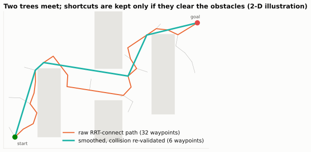
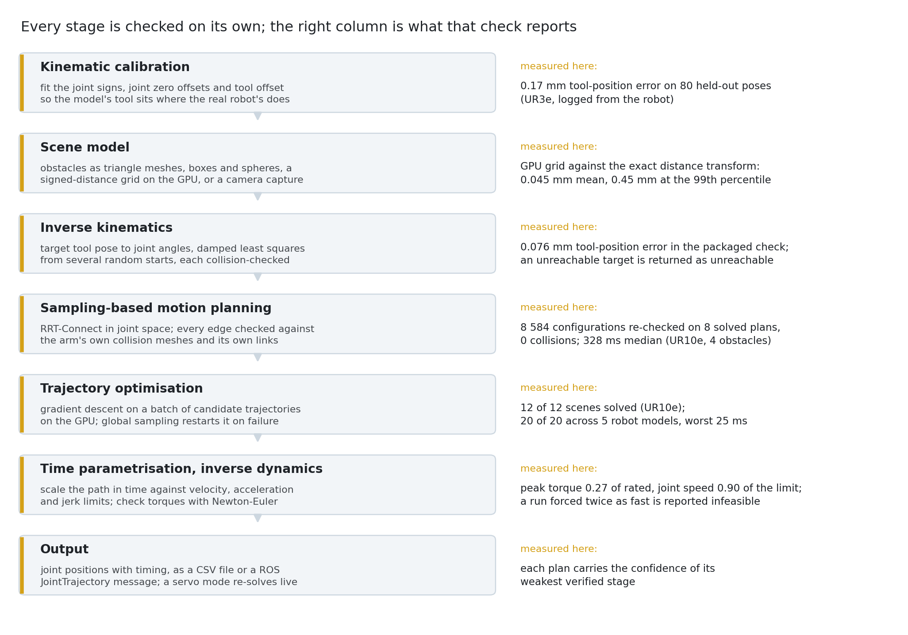
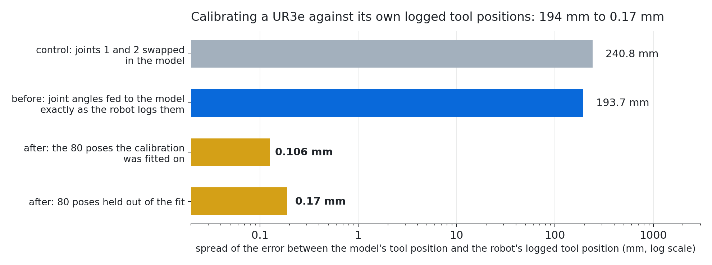

<picture>
  <source media="(prefers-color-scheme: dark)" srcset="docs/brand/banner-dark.png">
  
</picture>

> Part of 3FOLD · results are nodes in the [Decorrelation Graph Engine](https://github.com/antonbj3/3fold-graph-engine)

---

## What it is

Motion Engine is the platform's robot stack, at an early stage. It is a set of components rather than a finished product: model calibration, motion planning, trajectory timing, torque computation, dynamics identification, contact solving and grasping, each built and measured on its own, some joined into a pipeline that plans a move end to end, others still standing alone. It loads any URDF through one code path; six arm families have been run this way, UR, ABB, FANUC, KUKA, Motoman and Franka from the manufacturers' models, and two UR arms on recorded data from the real robots.

It began when the GPU planner we used would not plan reliably for a UR10 in our simulated cells while it did for a Franka, and nobody could say why. The aim is one stack that plans, times and grips instead of a program written per robot, for six-axis arms today and for mobile robots and humanoid hands next. The target is production: cells that pick, carry, place and assemble, and eventually a humanoid hand that assembles a product from its parts.

---

## How a plan is made

A UR10e is asked to reach a point on a shelf. The engine solves inverse kinematics from several starting guesses and accepts a solution inside 0.1 mm; the run shown landed at 0.025 mm. It grows a random tree of joint configurations from the start and another from the goal until they meet, checking every branch against the manufacturer's collision meshes, triangle geometry rather than spheres or hulls, and against the obstacles. The path is smoothed to a C² curve, each smoothing step re-checked for collision before it is kept. The trajectory is retimed against the joints' velocity, acceleration and jerk limits; inverse dynamics then gives the torque every motor has to deliver along it, which is checked against the motor limits.

<picture>
  <source media="(prefers-color-scheme: dark)" srcset="docs/fig/planner-demo-dark.svg">
  
</picture>

*The same loop in two dimensions: two trees meet, then shortcuts are tried and kept only if they clear the obstacles.*

---

## What is in it

- **Model against the real robot.** Recorded telemetry from a UR3e was compared with the engine's model. The first comparison was off by 194 mm at the tool: the recording's joint zero offsets did not match the model, one of them by π, and the tool frame was off by 0.25 mm. With those recovered, the held-out error was 0.17 mm. The convention is recorded as a UR-family property; its transfer to the UR10e has not been measured.
- **Planning.** Sampling planner on the arm's own collision meshes, GPU gradient planner for easy cases, two-stage combination. Run on a fleet of arm models. Unknown space treated as occupied exists as a 2-D grid cell, not yet wired to the arm planner.
- **Timing and torque.** Smoothing, timing against velocity, acceleration and jerk limits, torque on every motor from the inertias in the robot description. In the pipeline.
- **Dynamics from real machines.** Parameters identified on real Panda torque. Eight friction models run on real UR currents; the best reaches 0.73 of the variance against 0.66 for the per-joint standard. A separate friction model, validated on Panda torque, is the one wired into the torque check.
- **Contact.** Four interchangeable solvers behind one protocol: split impulse on the CPU, relaxed Jacobi on the GPU, a coloured Gauss-Seidel solver with body-pair chunks, and ColorCache, which keeps the colouring and the contact impulses between steps. ColorCache steps 10 000 bodies in 3.7 ms on an RTX 5070 and brings a 16-box stack to the penetration target in 40 iterations, where the pair-chunk solver needs 160. The CPU solver reproduces stick and slide at the friction angle with contact force equal to the weight. All GPU solvers give bit-identical results between runs: the Jacobi solver accumulates in int64 fixed point, the coloured solvers write disjoint memory per colour and use no atomics. The Jacobi solver is also bit-identical across an RTX 5070, an L4, an A10 and an H100; the two coloured solvers differ between the 5070 and the cloud cards, traced to one tangent-frame expression and still open. A 1000:1 mass ratio is reached by none of the solvers on valid geometry. An island solver that partitions the bodies by contact and solves the islands independently steps its declared fixtures in 2.9 ms, bit-identical between runs. A sweep of 20 substep and iteration configurations, each run exactly twice, finds no valid configuration under 2 ms at 10 000 bodies; the best at a 4 ms budget is 16 colours, 2 substeps and 16 iterations. Generating the body pairs on the RT cores was tried: the pairs are exact, but a full rebuild takes 0.87 ms at 10 000 bodies and 1.37 ms at 100 000, slower than the unchanged baseline, and it is kept as a recorded failure. A midpoint vertex-block-descent integrator exists as a separate engine and passes its own gates.
- **Grasping.** Friction-gripped picks on five arms with grip force against slip measured; stacking under friction; a vacuum grip sized against the motion in a full cell, with cup geometry and part mass from the CAD and the vacuum level and friction coefficient as class-typical values. Force-closure test as code only.
- **A cell.** One complete KUKA sequence: three workpieces, twenty-five phases, the sequence swept at 10 Hz against 198 moving and 159 static bodies with every bounding-box hit escalated to an exact intersection and no collision found, with the link inertias computed from the robot's own STEP files rather than taken from the description.
- **GPU kinematics and dynamics.** Batched forward kinematics on the GPU, matching the CPU reference to 0.55 µm. A GPU inverse-dynamics kernel exists and was checked against pinocchio on a Franka; that run is not stored.
- **Fast path for one family.** For the Franka arm the VAMP planner plans in under 4 ms, in VAMP's own sphere model of the arm; exact-mesh planning uses the tree planner.
- **Real-time loop.** A 20 millisecond servo loop against a signed-distance world model.
- **Humanoid.** Gait cells: the mechanism is partly reproduced, the gait gates do not pass, and the ankle fix made the static sag worse. On a hand, only a force-closure certificate as code.
- **Composition.** One script runs a signed-distance field from the field engine into the contact solver and writes the result as a node for the graph engine, with the three repositories as siblings (`examples/compose/`).
- **Code without a run.** Cartesian straight-line motion, CSV and ROS trajectory export, a learned dynamics twin that loads and runs for a Franka and a MELFA, without a UR10e twin in this environment.

<picture>
  <source media="(prefers-color-scheme: dark)" srcset="docs/fig8/stack-dark.png">
  
</picture>

*The components that are joined into a pipeline today.*

---

## Where it goes

Cells, not arms. The scene as a camera sees it rather than as boxes typed in, the gripper and the part inside the same planning as the arm, contact in the loop instead of alongside it, and the servo loop closing against the world model. Beyond arms: mobile robots and humanoids, with the same stack planning a hand that assembles.

Layers are meant to be replaceable: three of them carry protocols with arrays in and arrays out, two torque backends have been swapped in a demonstration, and the packaged stack is wired to one IK solver and one planner today.

<picture>
  <source media="(prefers-color-scheme: dark)" srcset="docs/fig8/calib-dark.png">
  
</picture>

---

## Papers

### Download the papers

Choose a PDF below. No GitHub account is needed.

| Paper | Topic | PDF |
| --- | --- | --- |
| P1 | Contact operators and solver limits | **[Download P1 (PDF)](https://raw.githubusercontent.com/antonbj3/3fold-motion-engine/main/docs/papers/P1.pdf)** |
| P2 | Deterministic contact sensitivities on GPUs | **[Download P2 (PDF)](https://raw.githubusercontent.com/antonbj3/3fold-motion-engine/main/docs/papers/P2.pdf)** |
| P3 | Exact particle counting | **[Download P3 (PDF)](https://raw.githubusercontent.com/antonbj3/3fold-motion-engine/main/docs/papers/P3.pdf)** |
| P4 | Static support boundaries | **[Download P4 (PDF)](https://raw.githubusercontent.com/antonbj3/3fold-motion-engine/main/docs/papers/P4.pdf)** |

Four measured studies (P1–P3 revision 3; P4 revision 4) with their reproduction bundles: contact-operator
structure and solver limits (P1), deterministic Coulomb-contact sensitivities on
GPUs (P2), reusing a solver grid for an exact point-in-box particle count (P3),
and static support boundaries with a full-LP witness (P4). The PDFs, exact
titles, per-paper source-availability limits and reproduction commands are in
[`docs/papers/`](docs/papers/README.md); the self-contained bundles are under
[`reproducibility/`](reproducibility/README.md). The canonical contact-scene
package is at [`data/ncp/scenes/`](data/ncp/scenes/) with its loader at
[`data/ncp/loader.py`](data/ncp/loader.py).
