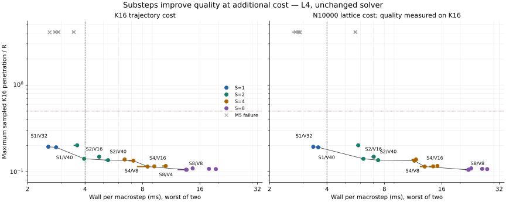

# Substep cost and stack quality

Queue19 measures the existing noncontracting ColorCache variant; no solver code
changes. The original K16 M5 fixture,600macrosteps,dt1/240,0.205pitch and physical
gates are unchanged. Substeps are1/2/4/8 and velocity rounds per substep are
4/8/16/32/40; position rounds remain10 per substep. Report total rounds per
macrostep explicitly: a40-round substep is not a40-round macrostep when S>1.

An adapter changes only the `substeps` argument passed by the original M5
metric. Capture all public state and force arrays after every macrostep and
hash all contact outputs using the retained physical observer. Two isolated
workers run the20configurations in opposite order. The S1/V40 result and full
contact trace must exactly match the retained noncontracting physical receipt.

Measure cost on a separate K16 replica over the same600macrosteps, after body
allocation; initial contact graph capture is included. Its complete final state
and forces must match the observed trajectory. Also measure N10000 two-layer
lattice10warm+30macrosteps at each configuration, without history observation,
and retain its final complete public state and forces. Large-fixture cost is
not claimed as the cost of the K16 trajectory.

Preregistered observer gates: all20configurations and both repetitions present;
complete numerical receipts and captured array bytes repeat exactly; unchanged
S1/V40 archive parity; observed/timed K16 final outputs exact; finite outputs
and positive finite timings; a nonempty physically valid Pareto set. Failed
physical configurations remain visible and cannot enter the selected set.
No requirement that substepping improve the result is imposed on the observer.

Pareto coordinates are maximum M5 penetration and worst-of-two measured wall
cost. Report frontiers separately for K16 and N10000 cost. For fixed budgets
0.5/1/2/4ms, select the physically valid configuration with lowest penetration
whose worst-of-two cost fits, then lowest cost, then smallest(S,V) to break ties.
An empty budget cell stays empty. The N10000 frontier pairs a K16 quality metric
with a separate throughput fixture; it is an engineering tradeoff table, not a
physical error estimate for the lattice or an external engine comparison.

Penetration is sampled at macrostep ends, exactly as in the original M5
metric. This does not bound every internal substep maximum. Position work
increases with the number of substeps; a better row would establish a measured
configuration tradeoff, not isolate smaller dt from extra position sweeps.

## Measured result

Modal L4, driver580.95.05, Warp1.13.0: observer6/6. All20numerical
configurations repeat exactly, including the original S1/V40 full-contact
archive anchor and observed/timed K16 parity. Four configurations fail the
original physical gate; sixteen pass. Full captured arrays:600/75325440bytes.

| S | V/substep | V/step | Pen/R | Original M5 | K16 ms, run1/run2 | N10000 ms, run1/run2 |
|---|---|---|---|---|---|---|
| 1 | 4 | 4 | 4.099979699 | INVALID | 2.848033/2.901156 | 2.640673/2.741597 |
| 1 | 8 | 8 | 4.099883139 | INVALID | 2.753576/2.785558 | 2.797082/2.840158 |
| 1 | 16 | 16 | 4.072653353 | INVALID | 2.609771/2.609851 | 2.877272/2.889323 |
| 1 | 32 | 32 | 0.193916857 | PASS | 2.567503/2.562439 | 3.379601/3.392233 |
| 1 | 40 | 40 | 0.191170275 | PASS | 2.794085/2.820363 | 3.548589/3.602970 |
| 2 | 4 | 8 | 4.098173678 | INVALID | 3.450549/3.490814 | 5.641138/5.602595 |
| 2 | 8 | 16 | 0.201620162 | PASS | 3.509942/3.637603 | 5.729087/5.840069 |
| 2 | 16 | 32 | 0.140916407 | PASS | 3.916507/3.958035 | 6.213234/6.084494 |
| 2 | 32 | 64 | 0.148784220 | PASS | 4.741784/4.716425 | 7.039589/6.889102 |
| 2 | 40 | 80 | 0.135890543 | PASS | 5.100331/5.279351 | 7.424041/7.313430 |
| 4 | 4 | 16 | 0.138397515 | PASS | 6.341921/6.451874 | 11.186260/11.723810 |
| 4 | 8 | 32 | 0.133891404 | PASS | 6.813155/7.168864 | 11.494685/11.311784 |
| 4 | 16 | 64 | 0.114499629 | PASS | 7.531581/8.509086 | 12.356609/13.020421 |
| 4 | 32 | 128 | 0.115200579 | PASS | 9.103548/9.222560 | 13.783140/14.421272 |
| 4 | 40 | 160 | 0.116449893 | PASS | 10.594253/10.199184 | 15.098511/15.177452 |
| 8 | 4 | 32 | 0.105477870 | PASS | 12.304517/13.526661 | 21.436800/22.150202 |
| 8 | 8 | 64 | 0.105215609 | PASS | 13.151290/13.634538 | 21.289876/22.044742 |
| 8 | 16 | 128 | 0.109244883 | PASS | 14.652863/14.472251 | 22.835690/22.358500 |
| 8 | 32 | 256 | 0.107804835 | PASS | 17.780329/17.840512 | 26.061091/25.588978 |
| 8 | 40 | 320 | 0.107180178 | PASS | 19.386814/19.315510 | 27.677461/27.564638 |

At fixed4ms, K16 selects **S2/V16**: pen/R0.140916407, worst wall3.958034507ms.
This uses32velocity and20position rounds per macrostep. The N10000 cost
frontier selects **S1/V40**: pen/R0.191170275 onK16 and worst lattice
wall3.602969933ms, with40velocity and10position rounds. At0.5/1/2ms,
no physically valid configuration fits either measured cost fixture.

The K16 choice has only0.041965493ms of margin under4ms across these two
samples; it is not a latency guarantee. More substeps improve sampled quality
at higher cost, but do not provide a submillisecond path in this matrix.

Horizontal bars span the two timings; they are not confidence intervals.
Black connecting lines show empirical Pareto frontiers. No default changes.
